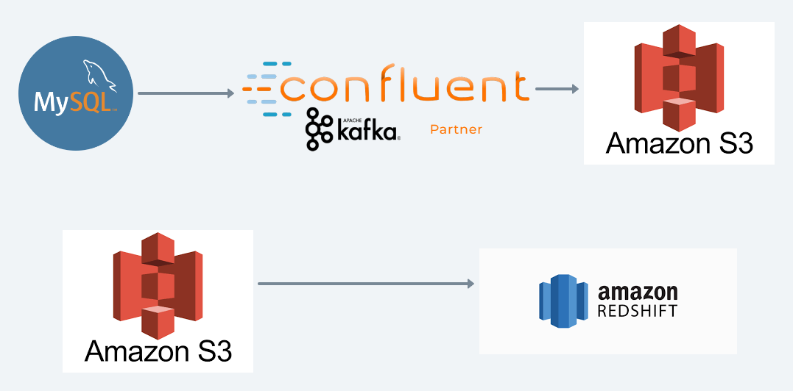
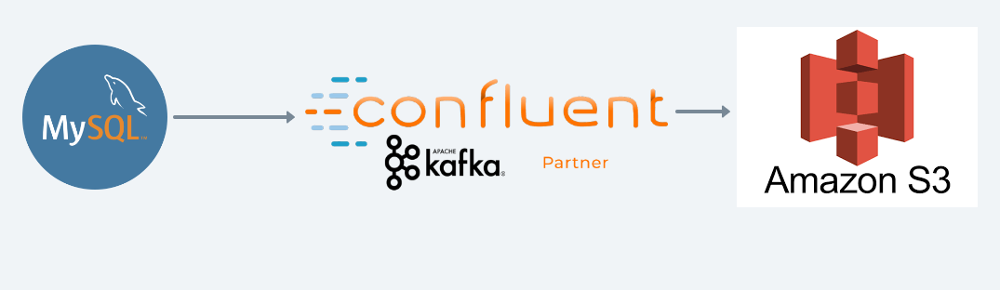
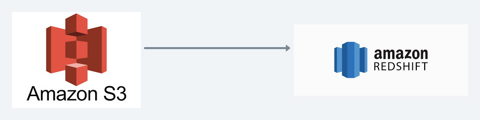

# Mysql-Redshift-Streaming-DataPipeine
This repo contain near real time streaming incremental load data pipeline code. 

Export data from mysql-database to AWS REDSHIFT using kafka.



Problem Statement:
We need to build an ETL pipeline to load mysql data base record to redshift using kafka


RedShift Dataware house

Approach
1. Read data from mysql and  send to kafka topic and from kafka topic we will load to s3 bucket


2. Read data from s3 bucket and load in REDSHIFT


Launch entire server setup
```
docker-compose up
```

Load data in mysql db
```
docker exec -i mysql sh -c 'exec mysql -uroot -p"$MYSQL_ROOT_PASSWORD"' < "./database-dump/mysqlsampledatabase.sql"
```


We will design Star Schema so that we can export above attached OLTP to OLAP

1. [Redshift setup](doc/REDSHIFT.md)
2. [Kafka setup](doc/CONFLUENT_KAFKA.md)

1. [MYSQL KAFKA S3](./mysql-kafka-s3/README.md) Project Description
2. [S3 Redshift](./kafka-redshift/README.md) Project Description


